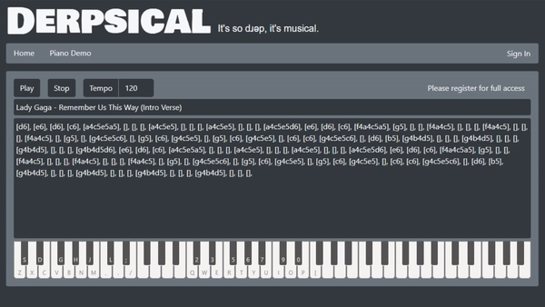

# Derpsical: It's so dɹəp, it's musical!
**`Technologies Used:`** Mongoose, Express, React, Node, Bootstrap, Javascript, AJAX

## `Summary`
A social media platform for musicians to create and share music

## `Highlights:`
- Built-in Piano App
- Social Media Aspects
- Creating & Sharing Music
- Self-Designed Scripting for Writing Music

## `Learning Experience`
- Learned to combo multiple packages together to create a virtual piano
- Gotten more proficient at passing props between components
- Gotten more proficient at stateful methods in React
- Learned to run multiple timed functions in sequence

## `Sample`


## `Code Snippets`
`Playing Notes via Script`
```
playNotes = () => {
    let string = this.state.noteScript.toLowerCase().replace(/\s/g, "");
    let chords = string.split(",")
    let timer = 0;
    Promise.all(chords.map(chord => {
      let promise = new Promise(resolve => {
        timer++;
        this.events.push(setTimeout(() => {
          let notes = chord.replace(/\[(.*?)\]/g, "$1")
          let newChord = []
          for (let i = 0; i < notes.length; i = i + 2) {
            let midiNumber;
            switch (notes[i]) {
              case "c":
                if (notes[i + 1] === "#") {
                  midiNumber = 1 + (12 * parseInt(notes[i + 2]))
                  newChord.push(midiNumber)
                  i++;
                } else {
                  midiNumber = 0 + (12 * parseInt(notes[i + 1]))
                  newChord.push(midiNumber)
                }
                break;
                // other switch cases omitted
            }
          }
          resolve(newChord)
          // calculates tempo for note duration into 8th notes
        }, (60000 / parseInt(this.state.tempo) / 2) * timer))
      })
      return promise.then(chord => {
        // create a copy of this.state.prevNotes
        let prevNotes = this.state.prevNotes.slice();
        // check chord length to avoid changing active state during waits
        if (chord.length > 0) {
          // use promise so it waits until loop is complete
          Promise.all(chord.map(note => {
            let promise = new Promise(resolve => {
              // set a variable = index of note
              let noteIndex = prevNotes.indexOf(note);
              // if note is not found...
              if (noteIndex === -1) {
                // resolve that note
                resolve(note)
              } else {
                // resolve a blank
                resolve("")
              }
            })
            // return promise which contains resolve value
            return promise;
          }))
            // after all promises have been resolved...
            .then(chordFilter => {
              // filter the new chord stored in chordFilters to remove blanks
              let filter = chordFilter.filter(note => note !== "");
              // update state to remove the notes that will be played next
              this.setState({
                notes: filter
              })
              // update state to play notes that were queued
              this.setState({
                notes: chord
              })
            })
          // set state's prevNotes to current notes
          this.setState({
            prevNotes: chord
          })
        }
      })
    }))
  }
```
`Nesting Components to pass props`
```
// passing parent height/width to make the element responsive
<DimensionsProvider> 
  {({ containerWidth, containerHeight }) => (
    <SoundfontProvider
      instrumentName="acoustic_grand_piano"
      audioContext={audioContext}
      hostname={soundfontHostname}

      // rendering functions to play notes into CustomPiano
      render={({ isLoading, playNote, stopNote }) => (
        <CustomPiano
          noteRange={noteRange}
          width={containerWidth}
          height={containerHeight}
          playNote={playNote}
          stopNote={stopNote}
          disabled={isLoading}
          keyboardShortcuts={keyboardShortcuts}
          activeNotes={this.state.notes}
        />
      )}
    />
  )}
</DimensionsProvider>
```

## `Links`
LinkedIn: https://www.linkedin.com/in/kerwinhy/<br>
GitHub: https://github.com/seiretsym<br>

## `Deployed Site:`
GitHub Pages: https://derpsical.herokuapp.com
